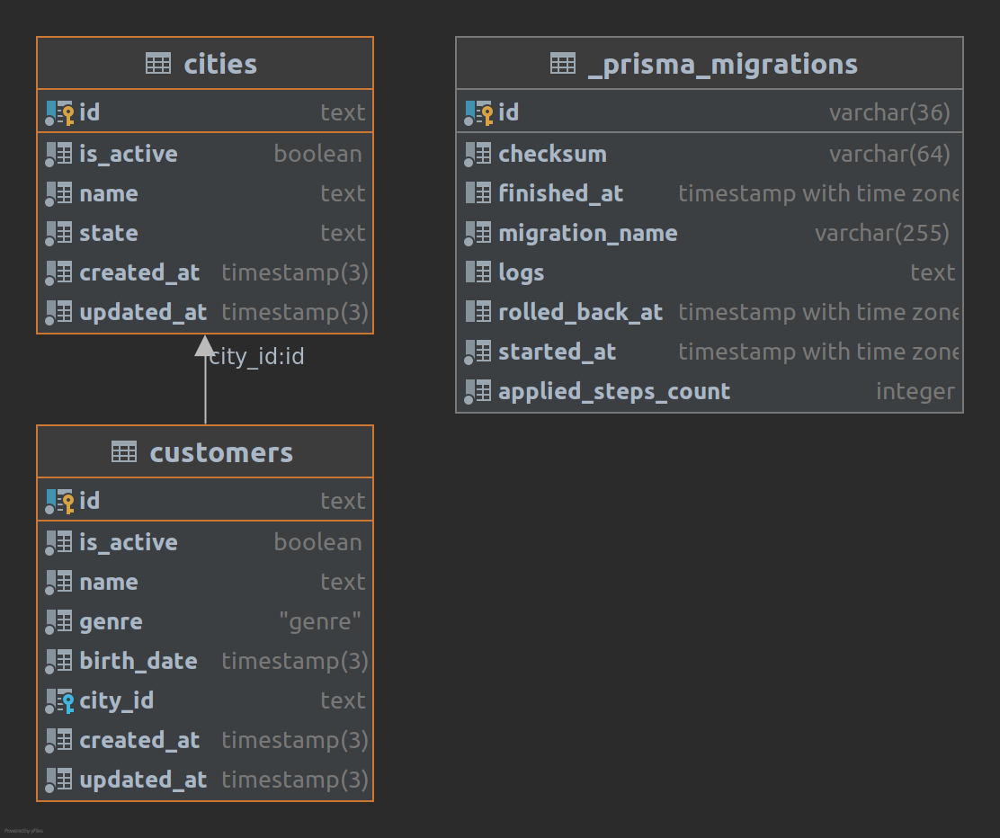

### Diagrama de Entidade Relacionamento

<h1 align="center">
    
</h1>

### Funcionalidades

- [x] Cadastrar cliente
- [x] Consultar cliente pelo nome
- [x] Consultar cliente pelo Id
- [x] Remover cliente
- [x] Alterar o nome do cliente

- [x] Cadastrar cidade
- [x] Consultar cidade pelo nome
- [x] Consultar cidade pelo estado

### Baixando e Instalando Depedências

```sh
 git clone git@github.com:Maxmiller-Nunes/cp-uol.git
```

```sh
 cd cp-uol
```

```sh
 yarn
```

### Executando Projeto

#### Crie um arquivo .env baseado no .env.example e preencha os campos como o exemplo seguinte:

```bash
POSTGRES_HOST=database
POSTGRES_USER=postgres
POSTGRES_PASSWORD=postgres
POSTGRES_DB=cp-uol
POSTGRES_PORT=5432
```

### Criando container do projeto (Desenvolvimento)

```sh
 docker-compose up -d --build
```

### Observando logs de desenvolvimento

```sh
 docker logs cp_uol_api -f
```

### Executado os testes

```sh
 yarn test #Alternativa yarn test --coverage
```
